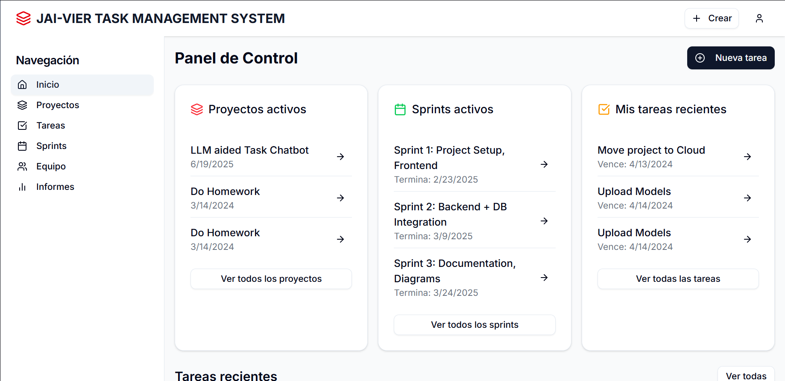
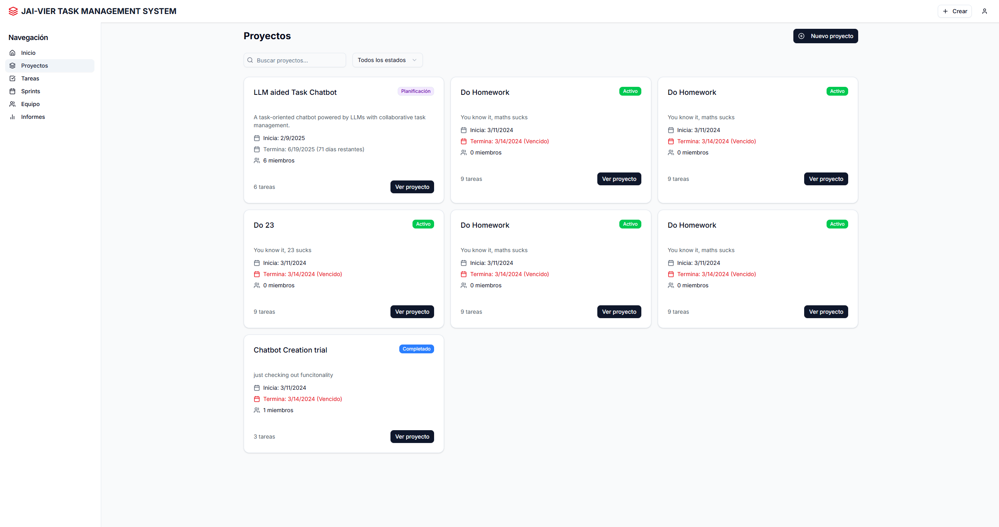
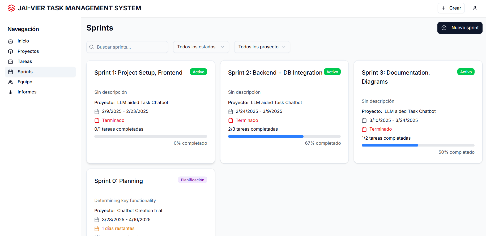
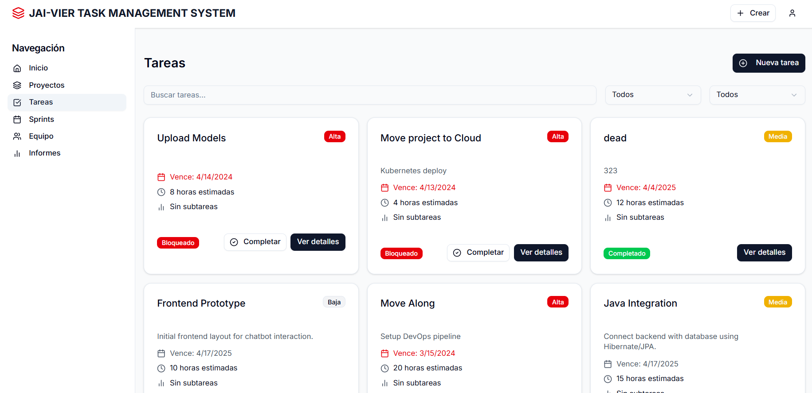
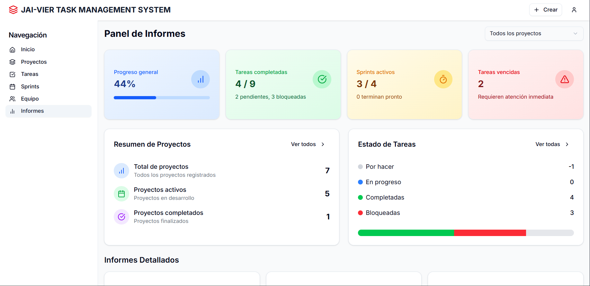
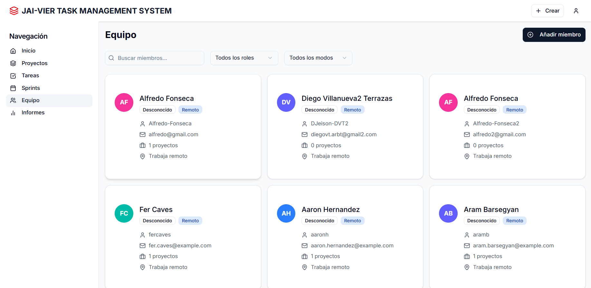

# JAI-VIER: Sistema de Gestión de Tareas

Un sistema completo de gestión de tareas inspirado en Jira, desarrollado con Next.js, TypeScript y patrones de diseño avanzados.


## Vista Previa

### Página de Inicio


### Gestión de Proyectos


### Gestión de Sprints


### Gestión de Tareas


### Detalles de Tareas


### Informes y Análisis


### Nuestro Equipo


## Características

- **Gestión de Proyectos**: Crear, editar y monitorear proyectos
- **Gestión de Sprints**: Organizar el trabajo en sprints con fechas de inicio y fin
- **Gestión de Tareas**: Crear, asignar y dar seguimiento a tareas y subtareas
- **Panel de Control**: Visualizar el estado de proyectos, sprints y tareas
- **Informes Detallados**: Analizar el progreso, la velocidad del equipo y las desviaciones de cronograma
- **Interfaz Intuitiva**: Diseño moderno y responsive con componentes de shadcn/ui

## Patrones de Diseño Implementados

- **Bridge**: Para separar tareas de los métodos de notificación
- **Factory**: Para crear tareas, dividiendo automáticamente las que superan 4 horas
- **Singleton**: Para manejar el estado de la aplicación en memoria
- **Composite**: Para trabajar con tareas y subtareas de manera uniforme

## Tecnologías Utilizadas

- **Frontend**: Next.js, React, TypeScript, Tailwind CSS
- **Componentes**: shadcn/ui (basado en Radix UI)
- **Iconos**: Lucide React
- **Formateo de fechas**: date-fns
- **Backend**: API REST con Spring Boot
- **Despliegue**: Docker

## Requisitos Previos

- Node.js 18.0 o superior
- npm o yarn
- Backend de Spring Boot ejecutándose en http://localhost:8081
- Docker (para despliegue)

## Instalación

1. Clona el repositorio:
   ```bash
   git clone https://github.com/equipo31/jai-vier.git
   cd jai-vier
   ```

2. Instala las dependencias:
   ```bash
   npm install
   # o
   yarn install
   ```

3. Configura las credenciales según las instrucciones proporcionadas al ejecutar el backend de Spring Boot.

4. Inicia el servidor de desarrollo:
   ```bash
   npm run dev
   # o
   yarn dev
   ```

5. Abre [http://localhost:3000](http://localhost:3000) en tu navegador.

## Estructura del Proyecto

```
CJ task-management-system/
├── .github/                # Configuración de GitHub y flujos de trabajo
├── .next/                  # Archivos generados por Next.js (build)
├── node_modules/           # Dependencias del proyecto
├── public/                 # Archivos estáticos accesibles públicamente
├── src/                    # Código fuente principal
│   ├── app/                # Páginas (App Router de Next.js)
│   │   ├── projects/       # Páginas relacionadas con proyectos
│   │   ├── reports/        # Páginas de informes
│   │   ├── sprints/        # Páginas relacionadas con sprints
│   │   ├── tasks/          # Páginas relacionadas con tareas
│   │   ├── users/          # Páginas de usuarios
│   │   ├── globals.css     # Estilos globales
│   │   ├── layout.tsx      # Componente de layout principal
│   │   ├── mock.txt        # Datos de prueba
│   │   └── page.tsx        # Página principal
│   ├── components/         # Componentes de UI reutilizables
│   ├── core/               # Lógica de negocio
│   ├── data/               # Modelos y gestión de datos
│   ├── lib/                # Utilidades y funciones auxiliares
│   └── services/           # Servicios para la API
│       ├── api/            # Implementación de servicios reales
│       ├── examples/       # Ejemplos de uso de servicios
│       └── mock/           # Servicios mock para desarrollo
├── components.json         # Configuración de componentes
├── docker/                 # Archivos de configuración de Docker
├── Dockerfile              # Definición de la imagen Docker
├── eslint.config.mjs       # Configuración de ESLint
├── next-env.d.ts           # Tipos para Next.js
├── next.config.ts          # Configuración de Next.js
├── package-lock.json       # Versiones exactas de dependencias
├── package.json            # Dependencias y scripts del proyecto
├── postcss.config.mjs      # Configuración de PostCSS
├── README.md               # Documentación del proyecto
├── simpleDiagram.txt       # Diagrama simple del sistema
└── tsconfig.json           # Configuración de TypeScript
```

## Uso

### Proyectos
- Visualiza todos los proyectos en la página de proyectos
- Crea nuevos proyectos con el botón "Nuevo proyecto"
- Accede a detalles, asigna miembros y administra sprints

### Sprints
- Organiza el trabajo en sprints con fechas de inicio y fin
- Monitorea el progreso de los sprints en tiempo real
- Analiza la velocidad del equipo y el rendimiento

### Tareas
- Crea tareas y subtareas con descripciones detalladas
- Asigna tareas a sprints y proyectos específicos
- Cambia el estado de las tareas (Por hacer, En progreso, Completado, Bloqueado)

### Informes
- Accede a informes detallados de tareas, sprints y proyectos
- Filtra y ordena los datos según tus necesidades
- Identifica cuellos de botella y proyectos en riesgo

## Despliegue con Docker

El proyecto está configurado para despliegue continuo mediante Docker. Al realizar un commit, se genera automáticamente un contenedor Docker.

Para construir manualmente el contenedor:

```bash
docker build -t jai-vier-frontend .
docker run -p 3000:3000 jai-vier-frontend
```

## Limitaciones Conocidas

Actualmente, existen algunos problemas con la implementación del backend. Entre ellos:

- Posibles interrupciones en la conexión API
- Algunas respuestas de la API pueden no incluir todos los campos esperados
- El frontend maneja respuestas nulas o vacías de manera graceful hasta que se estabilice el backend

## Equipo de Desarrollo (Equipo 31)

- **Tellez**: Project Manager / System Administrator, maneja documentación
- **Bañales**: Especialista en algoritmos, Java con Spring Boot, y apoyo en OCI
- **Diego**: Desarrollador Backend
- **Fernando Cuevas**: QA
- **Aaron**: Desarrollador Full Stack
- **Aram**: Intern

## Ajustes para Producción

Para preparar la aplicación para producción:

1. Compila el proyecto:
   ```bash
   npm run build
   # o
   yarn build
   ```

2. Inicia el servidor de producción:
   ```bash
   npm start
   # o
   yarn start
   ```

## Conexión con el Backend

Esta aplicación está diseñada para conectarse a un servidor backend en `http://localhost:8081`. Asegúrate de que el servidor esté funcionando antes de iniciar la aplicación.

Las credenciales específicas para la conexión a la API se generan al ejecutar el backend de Spring Boot. Consulta la documentación del backend para más detalles.

## Licencia

[MIT](LICENSE)

## Atribuciones

- Desarrollado por el Equipo 31
- shadcn/ui por los componentes base
- Lucide por los iconos
- Todos los contribuidores del proyecto